<div align="center">

<picture>
  <source media="(prefers-color-scheme: dark)" srcset="dark.svg">
  <source media="(prefers-color-scheme: light)" srcset="light.svg">
  
</picture>

</div>

<div align="center">

[](https://www.mridhulkrishna.in)
[](https://linkedin.com/in/mridhulkrishnatk)
[](https://github.com/Mridhul2k03)
[](mailto:mridhulkrishnatk@gmail.com)
[](https://www.google.com/maps/place/Calicut,+Kerala,+India)

</div>

---

## 👋 About Me

Backend Developer with **2+ years of experience** building scalable web applications using **Django** and **REST APIs**. Experienced in developing production-ready backend systems with **PostgreSQL**, **Redis**, and **Celery**, focusing on performance, reliability, and clean architecture. Skilled in cloud deployment and frontend integration with **React**, with hands-on experience delivering solutions for eCommerce platforms, CRM systems, and social media applications.

```python
class MridhulKrishna:
    role        = "Django Backend Developer"
    location    = "Calicut, Kerala, India 🇮🇳"
    experience  = "2+ years"
    projects    = "50+ delivered · 35+ actively in production"

    stack = {
        "backend"   : ["Django", "Django REST Framework", "Celery", "Redis"],
        "databases" : ["PostgreSQL", "MySQL", "SQLite3"],
        "frontend"  : ["React.js", "React TypeScript", "Tailwind CSS", "Bootstrap 5"],
        "devops"    : ["Git", "GitHub Actions", "CI/CD", "Linux/Ubuntu", "VPS", "cPanel"],
        "security"  : ["JWT", "OAuth 2.0", "CSRF", "CORS", "HTTPS/SSL/TLS", "Input Validation"],
    }

    domains = [
        "eCommerce", "CRM", "Social Media",
        "Healthcare APIs", "Job Portals", "Dashboards"
    ]

    focus = [
        "Database migrations & Query/ORM optimization",
        "Asynchronous task processing & Caching strategies",
        "Clean architecture, performance, and reliability",
    ]

    def say_hi(self):
        print("Building scalable, production-ready backend systems.")
```

---

## 🛠️ Tech Stack

| Category                   | Technologies                                                                                                                                                                                                                                                                                                                                                                                                                                                                                                                                                                                                                               |
| -------------------------- | ------------------------------------------------------------------------------------------------------------------------------------------------------------------------------------------------------------------------------------------------------------------------------------------------------------------------------------------------------------------------------------------------------------------------------------------------------------------------------------------------------------------------------------------------------------------------------------------------------------------------------------------ |
| 💻 **Languages**           |                                                                                                              |
| ⚡ **Frameworks & Libs**   |                                                                                 |
| 🗄️ **Databases & Caching** |                                                                                                                                                                                                                          |
| ⚙️ **DevOps & Cloud**      |       |
| 🔒 **Security & Concepts** | **JWT Authentication**, **OAuth 2.0**, **CSRF protection**, **CORS configuration**, **HTTPS / SSL/TLS**, **Input validation**, **Celery (async tasks)**, **Microservices**, **System design**, **Design patterns (MVC, MVT)**                                                                                                                                                                                                                                                                                                                                                                                                              |

---

## 💼 Work Experience

### **Django Developer** | [Exmedia](https://exmedia.in) _(Calicut, Kerala, India)_

_May 2024 – Present_

- 🚀 **Cross-Functional Leadership:** Spearheaded team efforts across backend, frontend, database, and cloud layers to successfully deliver **50+ web projects**, with **35+ backend applications** actively running in production.
- ⚙️ **Database & Performance Optimization:** Architected and optimized relational databases across **SQLite3**, **MySQL**, and **PostgreSQL**, leveraging **Redis caching** and **Celery** background job processing to boost performance and reliability for high-traffic systems.
- 🔌 **API Engineering:** Engineered secure, scalable **REST APIs** across diverse domains (e-commerce, job portals, social platforms, healthcare, dashboards, CRMs) with asynchronous processing for emails, notifications, and compute-heavy tasks.
- 💻 **Frontend Integration:** Partnered with frontend teams (**React**, HTML/CSS, JavaScript) to deliver responsive, performant UIs with seamless backend integration.

---

## 📌 Featured Projects

### 🔹 [Boat Rider Sports](https://github.com/Mridhul2k03/boatridersports.in-backend)

> **eCommerce platform for a Kerala-based bike dealer.**
> Led the development team in designing and building the backend architecture, database systems, and deployment infrastructure.
>
>      

### 🔹 Social Media App

> **Full-stack social media application with real-time features.**
> Developed cross-platform social application with React, Flutter, and Django backend.
>
>      

### 🔹 Custom CRM Platform

> **Tailored customer management and workflow automation system.**
> Developed a custom CRM platform using React and Django to streamline customer management, lead tracking, sales operations, and business workflow automation.
>
>    

---

## 📈 GitHub Stats

<div align="center">


</div>

<div align="center">


</div>

## 💬 Let's Connect

I'm open to **Django Backend**, **Lead Backend**, and **Full-Stack (Django + React)** opportunities — remote or hybrid from Calicut, Kerala.

- 📧 **Email:** [mridhulkrishnatk@gmail.com](mailto:mridhulkrishnatk@gmail.com)
- 📱 **Phone:** +91 95672 52212
- 🌐 **Portfolio:** [mridhulkrishna.in](https://www.mridhulkrishna.in)
- 🔗 **LinkedIn:** [linkedin.com/in/mridhulkrishnatk](https://linkedin.com/in/mridhulkrishnatk)

---

<div align="center">


_"First, solve the problem. Then, write the code."_

</div>
